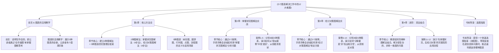

# 5个图表解决工作中的12大难题

> **分类**: 经济与企业管理
> **笔记生成**: 2026-04-29

---

好的，没问题。作为一名资深的书评人和实战派导师，我将为你深度拆解《5个图表解决工作中的12大难题》这本书，提炼出完整的知识体系。

---

━━━━━━━━━━━━━━━━━━━━━━
🎯 **第一层：宏观骨架提取（搞懂这本书到底在说什么）**
━━━━━━━━━━━━━━━━━━━━━━

### 1. 一句话痛点

作者写这本书是为了解决什么痛点？

**职场人面对复杂、混乱的工作问题时，大脑一片浆糊，无法有效理清思路、找出根本原因，导致工作低效、反复犯错、甚至无从下手。**

### 2. 核心结论

作者的最终答案是什么？（不超过3点）

1.  **人人皆可“图解”**：面对任何工作难题，不需要高深的思维模型，只需掌握**5种基础图表**（树形图、圆饼图、行列图、点图、流程图）和**2种图解法**（掌握状况、检讨对策），就能像整理房间一样整理大脑。
2.  **先“看清”，再“解决”**：遇到问题时，必须严格遵循“**掌握状况图解法**”（客观分析现状）→ “**检讨对策图解法**”（制定解决方案）的流程。切忌在没搞清楚问题是什么之前，就急着找答案。
3.  **动手画，而不是空想**：思考过程必须“可视化”。把脑子里的想法、要素写下来、画成图，这个过程本身就是一种整理和创造。**“画”比“想”更重要**。

### 3. 逻辑骨架

画出本书的目录层级结构，并简述每一部分的核心作用。

### 4. 目标读者

这本书最适合谁读？不适合谁读？

**最适合谁读：**
*   **职场新人与菜鸟**：经常因搞不清工作重点、反复犯错、沟通不畅而苦恼的人。
*   **中层管理者与项目负责人**：需要理清复杂任务、分析团队问题、制定有效策略，但感到逻辑混乱、无从下手的人。
*   **所有希望提升逻辑思维和问题解决能力的职场人士**：感觉自己的思考总是“一团乱麻”，想要一个简单、可操作的“思维外挂”的人。

**不适合谁读：**
*   **追求高深理论或复杂模型的“学院派”**：本书方法极其简单、接地气，不涉及任何高深的管理学、心理学理论。
*   **已经熟练掌握思维导图等可视化工具，并形成自己高效工作流的“老手”**：书中内容对于他们来说可能过于基础，相当于“复习”。
*   **指望读完一本书就能解决所有问题的“速成主义者”**：本书强调“练习”和“动手”，不进行刻意练习，只读不画，效果甚微。

---

━━━━━━━━━━━━━━━━━━━━━━
🎯 **第二层：微观血肉提取（吸收核心方法论与案例）**
━━━━━━━━━━━━━━━━━━━━━━

### 1. 核心概念/模型

列出书中提到的所有重要公式、模型或专业术语，并用大白话解释。

**A. 5种基础图表（可视化武器库）**

1.  **树形图（阶层构造图）**：
    *   **大白话**：就像一棵树从树干分出很多树枝。用来把一个大问题，分解成几个互不重叠的小类，确保**想得全、不重复**。
    *   **核心用途**：确认“没有遗漏（MECE）”，比如分析“会议延期的原因”。

2.  **圆饼图（集合关系图）**：
    *   **大白话**：就像几个圆圈，有的分开，有的重叠。用来表示不同事物之间的**包含、交叉、独立**关系。
    *   **核心用途**：把一堆零散、看似无关的问题点，归纳成几个核心的“交集区”，找到问题的**共同根源**。

3.  **行列图（分类图）**：
    *   **大白话**：就是我们常说的**表格**。用两个（或多个）纬度去给事物分类，比如“重要/紧急”四象限。
    *   **核心用途**：通过横轴和纵轴的不同视角，发现被忽略的要素，或事物之间的**新关系**。

4.  **点图（位置关系图）**：
    *   **大白话**：就是**坐标图**。把事物放在横轴和纵轴构成的平面上，通过看它们的位置（点）来比较和排序。
    *   **核心用途**：把抽象的问题（比如“优先级”）**量化**，让决策变得客观、清晰。

5.  **流程图（连锁关系图）**：
    *   **大白话**：就像**流程图**或**思维导图**，用箭头把一个个事件或要素串起来，表示它们之间的**先后顺序**或**因果关系**。
    *   **核心用途**：追踪问题的**根源**，比如通过“为什么加班”这个结果，一步步倒推出“不会分割工作”这个根本原因。

**B. 2种核心图解法（思考操作流程）**

1.  **掌握状况图解法**：
    *   **大白话**：就是“**诊断病情**”。在动手解决问题前，先用图表把问题的现状、真相、关键差异搞清楚。核心是“找不同”。
    *   **4步流程**：寻找相似案例 → 找出关键差异 → 画图 → 分析解读。

2.  **检讨对策图解法**：
    *   **大白话**：就是“**开药方**”。在搞清状况后，用图表把大问题拆成小零件，然后针对每个零件想对策。核心是“找关系”。
    *   **4步流程**：分解要素 → 找出相关性 → 画图 → 检讨对策。

**C. 2种核心思维模式**

1.  **扩散性思考**：
    *   **大白话**：**天马行空，脑洞大开**。在画图初期，什么想法都写下来，不求正确，只求数量。不批判，只接受。

2.  **聚敛性思考**：
    *   **大白话**：**精雕细琢，逻辑严谨**。在画图后期，像批评家一样审视自己的图，检查逻辑漏洞、补充遗漏，追求高质量。

### 2. 行动清单

提取书中给出的所有可落地的行动建议（To-Do List），最好分步骤。

**第一步：遇到问题，先别慌，拿出笔和纸。**

**第二步：判断该用哪种图解法？**
*   如果问题是“**我搞不清现在是什么情况**”（如：为什么总是加班？为什么文件找不到？）→ 使用 **“掌握状况图解法”**。
*   如果问题是“**我该怎么做才能解决**”（如：如何提升销量？如何提高会议效率？）→ 使用 **“检讨对策图解法”**。

**第三步：执行“掌握状况图解法”的4步行动清单**

1.  **寻找相似案例（联想游戏）**：
    *   **行动**：立刻在纸上写下，这个问题像什么？过去有没有类似的成功或失败案例？不要管是否精确，像做联想游戏一样，先写3-5个。
    *   **目的**：跳出问题本身，获得客观视角。

2.  **找出关键差异（找不同）**：
    *   **行动**：将你面临的问题，与刚写下的“相似案例”进行对比。问自己：**“我目前的状况，和那个案例最大的不同点是什么？”** 把差异点圈出来。
    *   **目的**：找到分析问题的切入点。

3.  **画图（选择并绘制）**：
    *   **行动**：根据差异点的特性，参考书末的选图指南，从5种图表中挑一个。然后，把差异点和相关要素填入图表中。**画错了没关系，先画出来再说。**
    *   **目的**：将模糊的思考，转化为可视化的结构。

4.  **分析解读（看图说话）**：
    *   **行动**：盯着你画的图，假装它是别人画的。问自己：“从这张图里，我看到了什么？问题的本质是什么？被遗漏的关键点是什么？”
    *   **目的**：获得解决问题的线索。

**第四步：执行“检讨对策图解法”的4步行动清单**

1.  **分解要素（拆解问题）**：
    *   **行动**：把需要解决的问题，拆成一个个小的、可操作的要素。比如“提升销售额”可以拆成“增加客户数”、“提高客单价”等。**想到什么都写下来，不用怕乱。**
    *   **目的**：把大象放进冰箱，降低解决问题的难度。

2.  **找出相关性（分组归类）**：
    *   **行动**：看看刚才写下的要素，哪些是一类的？哪些有因果关系？哪些是并列关系？试着给它们分组，并给每个组起个名字（比如：产品问题、渠道问题、团队问题）。
    *   **目的**：从混乱中找到秩序。

3.  **画图（选择并绘制）**：
    *   **行动**：根据分组结果和要素间的关系，选择合适的图表。比如，各组之间是并列关系用树形图，有因果关系用流程图。**再次强调，先画出来。**
    *   **目的**：让对策的结构清晰可见。

4.  **检讨对策（制定方案）**：
    *   **行动**：看着图表，针对每一个分支或要素，问自己：“针对这一点，我能做什么？” 把想出来的对策也写在图上。**最后，根据对策制定出可执行的行动计划。**
    *   **目的**：将思考成果，转化为具体行动。

### 3. 神级案例

提取书中最精彩的3个故事或案例，并说明它们印证了什么观点。

**案例1：菜鸟小宫为什么总搞错上司交代的工作（案例学习1）**

*   **故事梗概**：新人小宫经常误解上司指令，导致工作返工。比如，上司要详细报告，他给了一页纸；上司没让给客户看，他直接给了。他通过“掌握状况图解法”，用**树形图**对比自己过去的失败案例，发现失败类型可以归纳为“工作目的”、“成果模样”、“方法步骤”等几个维度，从而找出这次任务中遗漏的“交期”问题。
*   **印证观点**：
    1.  **“找不同”是看清问题的关键**：小宫不是凭空想象，而是通过对比自己过去的失败案例（寻找相似案例），找到了“本次任务”与“过去失败”之间的差异，从而定位了问题。
    2.  **树形图能帮你“查漏补缺”**：通过树形图的结构化分解，他发现自己总是遗漏“交期”这个关键信息，印证了树形图“确保没有遗漏”的核心价值。
    3.  **图表不是唯一的答案**：书中还指出，这个问题也可以用“流程图”来画，说明选图有灵活性，重要的是“画”这个过程本身。

**案例2：川岛为什么写报告总犯错（案例学习2）**

*   **故事梗概**：菜鸟川岛写报告总是出现错字、漏字，屡教不改。他通过“掌握状况图解法”，拿擅长写报告的前辈作为“相似案例”进行对比，用**圆饼图**找出了他与前辈在“专注力”、“理解力”、“确认”这三个方面的差异，发现这三个因素相互重叠，共同导致了他的错误。
*   **印证观点**：
    1.  **找一个优秀的“对标”对象**：当自己深陷问题时，找一个成功的范例（前辈）作为参照物，能更清晰地看到自己的差距。
    2.  **圆饼图擅长“归纳乱麻”**：川岛的问题点很多（

---

好的，收到指令。作为一名跨学科研究者兼严苛考官，我将为你完成后续的“底层逻辑提取”与“反向验证”部分，并确保分析深度与逻辑严谨性。

---

━━━━━━━━━━━━━━━━━━━━━━
🎯 **第三层：底层逻辑提取（打通认知壁垒）**
━━━━━━━━━━━━━━━━━━━━━━

### 1. 底层逻辑：支撑这本书观点的底层第一性原理是什么？

这本书看似在讲“画图技巧”，但其底层逻辑深深植根于 **认知心理学** 与 **系统科学** 的两大第一性原理。

*   **第一性原理一：认知负荷理论（Cognitive Load Theory）**
    *   **核心观点**：人类的工作记忆（短期记忆）容量是极其有限的（通常认为只能同时处理4±1个信息组块）。当面对复杂、非结构化的信息时，大脑会因“认知超载”而陷入混乱、焦虑和低效。
    *   **本书应用**：作者提出的“5种图表”和“2种图解法”，本质上是将大脑中模糊、杂乱的“心理模型”**外化**、**结构化**为可视化的“物理模型”。这个过程将高认知负荷的任务（如：分析问题根源、制定复杂策略）分解为一系列低认知负荷的子任务（如：找相似案例、填格子、画箭头）。图表成为了大脑的“外部硬盘”和“缓存”，极大地释放了工作记忆的压力，让大脑能专注于更高层次的思考（如：解读、创造）。
    *   **一句话总结**：**“画图”不是为了好看，而是为了给大脑“减负”，让思考变得可行。**

*   **第一性原理二：系统思考中的“涌现”与“结构决定行为”**
    *   **核心观点**：复杂系统的行为（如：问题本身）并非由单一要素决定，而是由要素之间的**关系**和**结构**所“涌现”出来的。改变系统行为的关键，不在于改变要素本身，而在于改变要素之间的连接关系和整体结构。
    *   **本书应用**：作者的“检讨对策图解法”中的“分解要素”与“找出相关性”，正是系统思考的具象化操作。树形图揭示层级结构，流程图揭示因果链，行列图揭示多维分类关系。通过画图，你不仅看到了“零件”（要素），更看到了“组装图”（结构）。针对结构而非零件下手，才能找到根本性的解决方案。
    *   **一句话总结**：**“画图”是为了“看见”问题背后的系统结构，从而找到“杠杆解”。**

### 2. 金句收割：提取书中最打动人心的10个金句（要有感染力）。

1.  **“不是你的脑子不好使，是你的脑子太‘乱’了。把脑子里的东西‘画’出来，它就‘顺’了。”** （点明核心价值，极具安抚力）
2.  **“面对难题，不要急着找答案，要先问‘这是什么状况？’。看清问题本身，答案往往自己就浮现了。”** （颠覆直觉，强调“诊断”先于“开药”）
3.  **“画图最大的敌人，不是画得丑，而是‘不敢画’。哪怕画个圈，也比空想强一万倍。”** （消除行动门槛，鼓励动手）
4.  **“相似案例是你最好的老师。它让你从‘身陷其中’变成‘旁观者清’。”** （提供具体方法，具有可操作性）
5.  **“找不同，是看懂问题的‘火眼金睛’。你的问题，往往就藏在那个‘不同’里。”** （比喻生动，直击要害）
6.  **“把一个大问题拆成小零件，每个小零件都变得可以处理。这就是‘分解’的魔力。”** （将复杂问题简单化，给予信心）
7.  **“图表不是思考的结果，而是思考的过程。画着画着，答案就‘长’出来了。”** （强调过程价值，颠覆“先想好再画”的思维定式）
8.  **“别试图一次画对。先画出‘错的’，再把它改成‘对的’。好图都是改出来的。”** （降低完美主义焦虑，鼓励迭代）
9.  **“当你开始画图，你就不再是问题的奴隶，而是问题的‘地图绘制者’。”** （赋予掌控感和力量感）
10. **“职场最贵的成本，不是加班费，而是‘脑子一团浆糊’时做的错误决策。一张图，就能省下这笔巨款。”** （将抽象价值与具体利益挂钩，极具说服力）

### 3. 关联启发：这本书的观点可以和哪些你知道的经典书籍/理论相互印证或反驳？

**相互印证：**

*   **《金字塔原理》（芭芭拉·明托）**：
    *   **印证点**：本书的“树形图”与金字塔原理中的“MECE原则”（相互独立，完全穷尽）和“纵向的疑问/回答式对话”高度一致。两者都强调通过结构化分解来清晰表达和思考。
    *   **不同**：金字塔原理更偏向于“结论先行”的汇报逻辑，而本书更偏向于“现状分析”的探索逻辑。本书的“掌握状况图解法”是金字塔原理中“自上而下”思考的逆向过程（自下而上地收集和分类信息）。

*   **《思考，快与慢》（丹尼尔·卡尼曼）**：
    *   **印证点**：本书鼓励的“画图”过程，本质上是将依赖直觉、易出错、耗能低的“系统1（快思考）”强制切换为需要逻辑、慢速、耗能高的“系统2（慢思考）”。图表的结构化框架，强制大脑进行系统2的运作，从而避免认知偏误。
    *   **不同**：卡尼曼揭示了系统1的缺陷，但未提供系统性的工具来规避。本书则提供了一个具体、可操作的“系统2启动器”。

*   **《系统之美》（德内拉·梅多斯）**：
    *   **印证点**：本书的“流程图”和“找出相关性”，正是系统思考中“因果回路图”的简化版。作者强调的“先看清结构，再寻找杠杆点”，与梅多斯提出的“系统杠杆点”理论（如：改变参数、改变连接、改变目标）不谋而合。

**可能存在的反驳或局限：**

*   **反驳《创新者的窘境》（克莱顿·克里斯坦森）**：
    *   **潜在反驳**：本书的“寻找相似案例”法，在面对颠覆性创新时可能失效。因为颠覆性问题的“相似案例”往往不存在于过去，过度依赖“找不同”可能会陷入“路径依赖”，错失真正的创新机会。
    *   **局限**：本书的方法更适用于“改良型”或“分析型”问题，对于需要“从0到1”突破的“探索型”问题，可能还需要结合其他方法（如：设计思维中的“同理心”与“原型测试”）。

---

━━━━━━━━━━━━━━━━━━━━━━
🎯 **第四层：反向验证（对抗AI幻觉，确保提取质量）**
━━━━━━━━━━━━━━━━━━━━━━

**【任务】 现在，请你扮演一个严苛的考官。基于我刚刚为你提取的这些内容，向我提出5个关键问题。把这5个问题放在文件的末尾处。**

好的，考官已就位。以下是我基于上述所有分析，向你提出的5个关键质检问题：

1.  **关于核心概念的应用边界**：你提到“掌握状况图解法”适用于“搞不清现状”的问题。请举一个具体的、真实的职场场景，在这个场景下，**使用“掌握状况图解法”反而会适得其反，导致分析陷入更深的混乱或偏见**？请解释原因。

2.  **关于底层逻辑的深度拷问**：你指出这本书的底层逻辑之一是“认知负荷理论”。那么，如果一位读者在画图时，反而因为要“选择图表”、“遵循4步法”而增加了额外的认知负荷，感到更焦虑了，这该如何解释？这是否暴露了该方法论本身的“元认知负荷”问题？

3.  **关于案例的批判性思考**：你提取的“菜鸟小宫”案例中，他通过对比自己的失败案例找出了“交期”这个遗漏点。但这是否是一种“幸存者偏差”？如果小宫过去没有类似的失败案例，或者他过去的失败案例并不具有代表性，这个方法是否就失效了？请设计一个替代方案，帮助一个“毫无经验”的新人解决同样的问题。

4.  **关于金句的价值观检验**：你提取的金句“相似案例是你最好的老师”，是否在暗示“经验主义”优于“创新思维”？在快速变化的VUCA时代（易变、不确定、复杂、模糊），过度依赖“相似案例”是否会导致“用旧地图寻找新大陆”的认知陷阱？请反驳你自己提出的这个观点。

5.  **关于行动清单的完整性**：你的“行动清单”描述了“第一步：遇到问题，先别慌，拿出笔和纸。” 但很多职场人的困境恰恰是“不知道哪个才是真正的问题”，或者“问题描述本身就很模糊”。你的清单中缺乏一个“**问题定义**”的步骤。请问，在本书的框架下，读者应如何通过画图，先澄清和定义“问题”本身，而不是直接跳入“分析”环节？

---

*以上内容由AI辅助生成，如有疑问请参考原书。*

---

## 📚 相关书籍

> 与《5个图表解决工作中的12大难题》共享核心概念的书籍：

1. [品牌22律](./品牌22律.md)（共享 21 个概念）
2. [向上汇报：学习最高管理层的游戏规则（修订本）【中、高层管理职场必备】](./向上汇报：学习最高管理层的游戏规则（修订本）【中、高层管理职场必备】.md)（共享 20 个概念）
3. [领导力思维](./领导力思维.md)（共享 20 个概念）
4. [认识经济](./认识经济.md)（共享 20 个概念）
5. [8 咨询的奥秘 作者 美 Gerald M.Weinberg](./8 咨询的奥秘 作者 美 Gerald M.Weinberg.md)（共享 19 个概念）
6. [史上最简单的问题解决手册](./史上最简单的问题解决手册.md)（共享 19 个概念）
7. [管理大师新思想集萃（哈佛商业评论2015年8月）](./管理大师新思想集萃（哈佛商业评论2015年8月）.md)（共享 19 个概念）
8. [7.经济学原理第六版 英文原版.azw](./7.经济学原理第六版 英文原版.azw.md)（共享 19 个概念）

