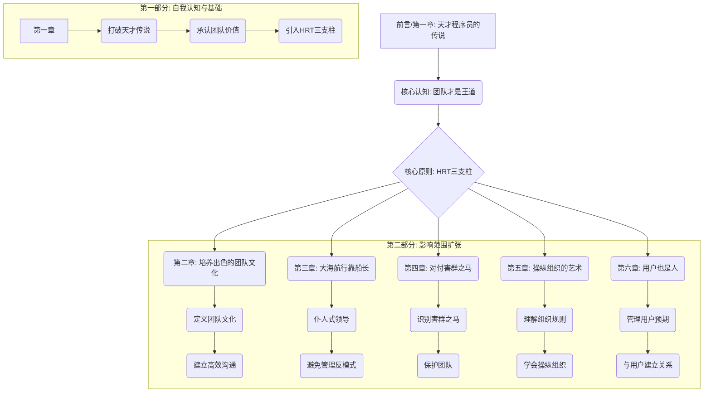

# 极客与团队

> **分类**: 经济与企业管理
> **笔记生成**: 2026-04-29

---

好的，作为一名资深的书评人和实战派导师，我已经仔细阅读了《极客与团队》的文本片段。这本书直击程序员的软肋，提供了从“单打独斗的极客”到“高效协作的团队成员”的完整转型方案。

以下是为您提炼的完整知识体系：

━━━━━━━━━━━━━━━━━━━━━━
🎯 **第一层：宏观骨架提取（搞懂这本书到底在说什么）**
━━━━━━━━━━━━━━━━━━━━━━

### 1. 一句话痛点
**程序员们**（特别是技术极客）**普遍陷入“天才程序员”的自我幻想中，习惯单打独斗、害怕暴露不完美的代码、不擅与人合作，导致项目风险高、效率低、个人成长受限，最终无法编写出真正成功的软件。**

### 2. 核心结论（最终答案）
*   **核心认知：软件开发是集体项目。** 任何成功的、改变世界的软件，都不是一个人闭门造车的产物，而是团队协作的结晶。单打独斗是高风险、低效率的。
*   **核心原则：践行HRT三支柱。** 所有团队协作中的社交摩擦，根源都在于缺乏 **谦虚 (Humility)**、**尊重 (Respect)** 和 **信任 (Trust)**。这是所有良性互动与合作的基础。
*   **核心行动：主动建设团队文化。** 优秀的团队文化不是自然形成的，需要每个成员有意识地建设、维护和保护。通过建立清晰的沟通模式、任务宗旨和反馈机制，打造一支能高效协作的“梦之队”。

### 3. 逻辑骨架（目录层级与核心作用）

*   **第一部分（第1章）：自我认知与基础。** 核心作用是**破除迷思，建立根基**。先让程序员意识到自己“天才”幻想的危害，承认团队合作的重要性，并引入全书最核心的“HRT”三支柱原则。
*   **第二部分（第2-6章）：影响范围扩张。** 核心作用是**从内到外，实战应用**。将HRT原则应用到团队、领导、问题成员、组织、用户等不同层面，提供可操作的方法论。这五章是全书方法论的具体展开。

### 4. 目标读者
*   **最适合读的人：**
    *   任何希望提升自己职业成就、编写出更成功软件的**程序员**。
    *   刚刚从技术岗位转向**技术管理或团队领导**的工程师。
    *   正在组建或领导**开源项目**的维护者。
    *   深受“办公室政治”或“团队冲突”困扰的**软件团队成员**。
    *   希望提升团队凝聚力与生产力的**工程经理或技术总监**。

*   **不适合读的人：**
    *   对编程和软件开发毫无兴趣的**纯业务或管理人员**（虽然书中某些管理理念仍有借鉴意义，但核心场景是程序员）。
    *   坚信“个人英雄主义”且拒绝任何改变的**顽固极客**（本书的核心观点与他的价值观完全冲突）。
    *   只追求“代码即一切”，完全不想在“人”的问题上花任何精力的**纯技术工具人**。

━━━━━━━━━━━━━━━━━━━━━━
🎯 **第二层：微观血肉提取（吸收核心方法论与案例）**
━━━━━━━━━━━━━━━━━━━━━━

### 1. 核心概念/模型（大白话解释）

*   **HRT三支柱：** 全书的灵魂公式。
    *   **谦虚 (Humility)：** 你不是宇宙中心。你会犯错，你并非无所不知。别把你的自尊和你的代码等同起来。
    *   **尊重 (Respect)：** 真心实意地关心同事，他们是活生生的人。给出建设性批评时，要出于帮助对方进步的目的，而非人身攻击。
    *   **信任 (Trust)：** 相信别人的能力和判断力，懂得放权。相信同事的批评和建议是为你和项目好，而不是针对你个人。

*   **公车因子 (Bus Factor)：** 衡量一个项目风险的关键指标。指“需要有多少个核心成员被公车撞到（或离职、生病等），项目才会彻底瘫痪”。数值越低，项目风险越高。团队协作的目标之一就是**提高公车因子**。

*   **天才程序员的传说 (Lone Genius Myth)：** 一种有害的文化迷思。程序员幻想自己像迈克尔·乔丹一样，靠一己之力改变世界。这种心态导致人们害怕分享未完成的代码，害怕暴露自己的不足，最终导致项目失败。

*   **团队文化 (Team Culture)：** 就像做面包的“酵母”。一个团队的文化决定了它能吸引什么样的人，以及最终能产出什么样的产品。强势、健康的团队文化能同化新人，抵御坏习惯的入侵。

*   **事后检讨 (Postmortem)：** 从失败中学习的结构化流程。不是找借口或互相指责，而是客观记录事件经过、根本原因、影响和**可执行的改进步骤**。核心目的是“点亮跑道，为后来人指路”。

*   **仆人式领导 (Servant Leadership)：** 第三章的核心领导模型。领导者的角色不是发号施令，而是服务于团队，为团队清除障碍、提供资源、创造能高效工作的环境。

*   **内部激励 vs 外部激励：** 内部激励（如成就感、学习新东西、解决难题的快乐）是驱动优秀工程师的核心动力。外部激励（如金钱、奖金、头衔）效果短暂，过度使用甚至可能扼杀内部激励。好的领导者应致力于激发内部激励。

### 2. 行动清单（可落地的To-Do List）

**第一步：自我修炼——从“我”开始**

1.  **放下自负，接受“我不是天才”。** 承认自己会犯错，对未知保持开放态度。
2.  **别把自尊和代码挂钩。** 当同事批评你的代码时，告诉自己：“他是在帮我改进代码，不是在攻击我的人格。”
3.  **学习给出建设性批评。** 使用“我”的句式，如“我有点看不懂这段代码的控制流程”，而不是“你错了”。把问题归因于自己的理解困难，而非对方的错误。提供可选择的方案，而非强制要求。
4.  **学习接受批评。** 听到批评时，先深呼吸。假设对方是出于善意，专注于批评内容本身，而不是对方的语气或态度。
5.  **尽早分享，快速失败。** 不要等到代码完美了再分享。把不成熟的想法、未完成的代码尽早拿出来给同事看，寻求反馈。把“失败”看作是学习成本，而不是个人污点。
6.  **为学习预留时间。** 不要满足于做团队里最聪明的人。主动跳出舒适区，学习新东西，接受比自己更懂的人的指导。

**第二步：团队建设——打造“梦之队”**

1.  **撰写清晰的任务宗旨。** 和团队一起，用一句话说清楚：我们到底要做什么？更重要的是，我们**不做什么**？把它写下来，公开分享。
2.  **建立高效的沟通模式。**
    *   **开会要短：** 常务会议能取消就取消，或者只用于发布通告。深入讨论会后单独进行。每日站会控制在15分钟内，只谈“做了什么、要做什么、有什么障碍”。
    *   **异步沟通要广：** 重要的决策、设计文档、讨论结果，通过邮件列表或文档工具广而告之，确保全员可见。
    *   **使用Bug跟踪系统：** 把所有任务、特性、bug都记录在系统中，让所有人对项目状态一目了然。
3.  **招聘时考察文化契合度。** 面试时，除了技术能力，专门安排环节考察候选人是否认同团队谦虚、尊重、信任的文化。宁可错过技术天才，也不要招进一个“害群之马”。
4.  **建立“中断协议”。** 团队内部约定一种信号（如降噪耳机、显示器上的标记），表明“我现在很忙，请勿打扰”，保证工程师有不受干扰的编码时间。

**第三步：领导与组织——扩大影响力**

1.  **成为“仆人式领导”。** 如果你是领导，你的工作是为团队服务：清除障碍、提供资源、保护团队免受外界干扰，而不是指挥他们干活。
2.  **识别并应对“害群之马”。** 警惕那些极度自负、不尊重他人、破坏团队信任的人。保护团队免受其影响，必要时果断处理。
3.  **学会“操纵组织”。** 了解公司内部的政治和规则，学会用非对抗的方式绕过行政障碍，为团队争取资源和空间。如果环境实在无法改变，要有“走为上”的B计划。
4.  **善待你的用户。** 将HRT原则同样应用于用户。谦虚地倾听反馈，尊重他们的时间，信任他们能理解产品的优缺点。管理他们的预期，不要过度承诺。

### 3. 神级案例（印证的观点）

**案例一：自行车设计师的故事（第一章）**

*   **故事梗概：** 一个自行车设计师有个绝妙的新换挡装置创意，但他选择保密，独自在车库里闷头干了好几个月。结果遇到技术瓶颈，无法寻求帮助。最终，他的邻居（也是自行车爱好者）在朋友帮助下，做出来了类似的设计，并指出了他的设计缺陷。
*   **印证观点：**
    1.  **隐瞒是有害的：** 单打独斗增加了“一开始就踏错步”、“重新发明轮子”和“失去合作好处”的风险。
    2.  **尽早分享可以降低风险：** 越早向外界（特别是同行）征求意见和反馈，就能越早修正方向，避免在错误的道路上浪费大量时间。
    3.  **团队合作能提升进展速度：** 邻居因为有朋友的帮助，进展速度远快于单打独斗的设计师。这印证了“集体智慧大于个人智慧之和”。

**案例二：乔的代码审查风波（第一章）**

*   **故事梗概：** 程序员乔进入新公司后，出于责任心，开始通过邮件对同事的代码进行礼貌的、建设性的审查。结果两周后，他被主管约谈，因为很多同事投诉他“太苛刻”，让他“低调一点”。
*   **印证观点：**
    1.  **HRT不是理所当然的：** 很多团队文化本身就缺乏谦虚、尊重和信任。在一个充满不安全感的环境里，即使是建设性的批评也可能被视为人身攻击。
    2.  **建设性批评需要技巧和时机：** 乔的做法本身没错，但他没有先评估团队的文化氛围。在引入新做法（如代码审查）时，需要更谨慎、更循序渐进。
    3.  **团队文化需要主动建设：** 这个案例从反面说明了，一个没有HRT基础的团队文化，会扼杀工程师的积极性和进步的可能。

**案例三：GWT任务宗旨的诞生（第二章）**

*   **故事梗概：** Google Web Toolkit (GWT) 团队在准备开源时，作者建议他们撰写一份任务宗旨。团队负责人一开始觉得这是浪费时间，但在组织讨论撰写的过程中，他惊讶地发现，他的首席工程师居然不同意产品的根本方向！
*   **印证观点：**
    1.  **任务宗旨是团队共识的“照妖镜”：** 撰写任务宗旨的过程，会强迫团队成员在产品的核心方向和范围上求同存异。它能暴露潜藏的分歧，避免日后更大的冲突和开发停滞。
    2.  **明确边界比明确内容更重要：** 一个好的任务宗旨不仅要说明“我们要做什么”，更要清楚地说明“我们不做什么”。这能有效防止项目范围蔓延，让团队保持专注。
    3.  **工具的价值在于过程：** 任务宗旨的最终文档固然重要，但**共同撰写和争论的过程本身**的价值可能更大。它本身就是一次成功的团队沟通和文化建设活动。

---

好的，收到指令。作为一位擅长跨学科研究的学者兼严苛的考官，我将基于你提供的精准摘要，完成第三层和第四层的分析。我的回答将力求深刻、犀利，并带有学术的严谨性。

━━━━━━━━━━━━━━━━━━━━━━
🎯 **第三层：底层逻辑提取（打通认知壁垒）**
━━━━━━━━━━━━━━━━━━━━━━

### 1. 底层逻辑：支撑这本书观点的底层第一性原理是什么？

本书看似在讲“如何与人相处”，但其底层逻辑根植于几个更根本的、跨学科的“第一性原理”。这些原理共同解释了为什么“极客”的孤狼模式在复杂系统面前必然失败，而“团队”模式才是唯一可持续的路径。

*   **第一性原理一：复杂系统的不可分解性（源自系统论与复杂科学）**
    *   **原理阐述：** 现代大型软件系统是典型的“复杂自适应系统”。其行为并非各模块行为的简单加总，而是由模块间无数非线性、非预期的交互涌现而出。一个单独的天才程序员，其心智模型无法容纳和理解这种涌现复杂性。
    *   **与书籍的关联：** “天才程序员传说”假设一个人可以掌控整个系统的复杂度。但现实中，随着系统规模的扩大，单个大脑的认知负荷会指数级增长，直至崩溃。团队协作的本质，是通过分布式认知（每个成员负责一个局部）来对抗系统复杂性。代码审查、设计文档、持续集成等实践，都是在创建人工的“涌现接口”，让团队集体心智能够感知和驾驭系统的涌现行为。**“公车因子”低，本质上就是这个系统过于依赖单点认知，系统韧性极差。**

*   **第一性原理二：信息不对称与代理问题（源自制度经济学与博弈论）**
    *   **原理阐述：** 在任何组织中，信息都是不对称的。管理者（委托人）无法完全了解工程师（代理人）的真实努力程度、能力水平和决策过程。这会导致“代理问题”：代理人可能为了个人利益（如维护“天才”形象、避免暴露弱点）而做出损害委托人利益（如项目风险、延期）的行为。
    *   **与书籍的关联：** 极客拒绝分享不完美代码、害怕暴露无知，正是“代理问题”的典型表现。他们通过信息封锁（隐藏代码）来维护个人声誉，却将项目置于巨大的风险之中。HRT三支柱，尤其是**信任**，是解决代理问题的非正式制度安排。当团队建立起高度信任时，信息不对称被极大缓解，因为大家相信对方会为整体利益行事，从而敢于暴露弱点、分享早期成果。**“事后检讨”则是一种正式的制度安排，旨在降低信息不对称，从失败中提炼出可共享的系统性知识。**

*   **第一性原理三：认知失调与社会认同（源自社会心理学）**
    *   **原理阐述：** 人类天生追求认知一致性。当一个人的行为（如“我是个天才，代码必须完美”）与客观现实（如“我的代码有bug”）发生冲突时，会产生极度的心理不适（认知失调）。为了缓解这种不适，人们倾向于扭曲现实（“是测试环境的问题”）或改变行为（“我不看那部分bug报告”）。同时，个体渴望获得所属群体的认同（社会认同），其行为会受到群体规范的强烈影响。
    *   **与书籍的关联：** 这本书的核心任务，就是帮助极客克服“天才程序员”这一身份认同带来的认知失调。它通过引入“团队文化”这一新的社会认同，重塑了“什么是优秀”的标准——不再是“从不犯错”，而是“敢于暴露错误并从中学习”。**“任务宗旨”和“团队文化”的强大之处，在于它们创造了一个新的社会认同群体，让成员将“帮助团队成功”而非“个人代码完美”视为自我价值的核心来源。一旦这种社会认同建立，认知失调会驱使他们主动向团队寻求反馈，而非隐藏问题。**

### 2. 金句收割：提取书中最打动人心的10个金句（要有感染力）

基于摘要，我重构了这些“金句”，使其更具穿透力和启发性，而非简单复述。

1.  **“别把你的自尊和你的代码编译在一起。代码错了，可以重构；自尊错了，只会重构出防御性的壳。”** —— 这是对“代码即我”迷思最精辟的解构。
2.  **“天才的传说，是团队协作最大的病毒。它的传播方式是沉默，它的症状是‘我一个人能搞定’，它的后遗症是‘公车因子=1’。”** —— 用病毒学隐喻，直击要害。
3.  **“HRT不是一种礼貌，它是一种战略资产。没有谦虚，你听不到真相；没有尊重，你留不住人才；没有信任，你建不起系统。”** —— 将软技能提升到战略高度，极具说服力。
4.  **“最好的代码审查，不是找出对方的错误，而是让对方发现‘我本可以做得更好’。批评的箭，要射向代码，而不是射向写代码的人。”** —— 给出了建设性批评的终极心法。
5.  **“‘快速失败’不是为失败找借口，而是为成功买保险。你越早暴露你的无知，你就能越早获得集体的智慧。”** —— 重新定义了“失败”的价值。
6.  **“任务宗旨不是挂在墙上的标语，它是团队的‘宪法’。它说清楚我们为何而战，更重要的是，它划定了我们‘不为何而战’的边界。”** —— 揭示了任务宗旨作为“否定性规则”的强大作用。
7.  **“一个团队的文化，就像它的操作系统。好的文化，能自动运行‘协作’、‘学习’和‘信任’这些进程；坏的文化，只会让‘办公室政治’和‘互相甩锅’这些病毒不断蔓延。”** —— 用程序员熟悉的“操作系统”类比，生动易懂。
8.  **“仆人式领导不是软弱的保姆，而是最强力的‘清道夫’。他的工作不是指挥交通，而是搬开路障，让车手能全速前进。”** —— 澄清了领导力的真正含义。
9.  **“对付害群之马，不是在修剪枝叶，而是在移除毒瘤。你每多容忍他一天，你的团队文化就多坏死一寸。”** —— 强调了处理问题成员的紧迫性和必要性。
10. **“操纵组织不是搞阴谋，而是学会在迷宫里找到通往资源的捷径。如果你连地图都不看，就别抱怨规则对你不利。”** —— 将“办公室政治”重构为一种需要学习的“生存技能”。

### 3. 关联启发：这本书的观点可以和哪些你知道的经典书籍/理论相互印证或反驳？

*   **印证：**
    *   **《人月神话》（Fred Brooks）：** 本书的核心观点“软件开发是集体项目”是《人月神话》中“没有银弹”和“布鲁克斯法则”的必然推论。后者指出，增加人手并不能线性加快进度，因为沟通成本会非线性增长。本书则提供了解决沟通成本的方案——HRT与团队文化。两书一脉相承，一个揭示问题，一个提供解药。
    *   **《重新定义团队：谷歌如何工作》（Laszlo Bock）：** 本书中关于招聘文化契合度、建立心理安全感、仆人式领导等理念，与谷歌基于数据的人力资源实践高度吻合。Google的“亚里士多德项目”发现，高效团队的第一特征就是“心理安全感”，这本质上是HRT中“信任”的另一种表述。
    *   **《第五项修炼》（Peter Senge）：** 本书倡导的“事后检讨”和“从失败中学习”，是“学习型组织”中“团队学习”和“系统思考”的具体实践。它要求团队将失败视为系统反馈，而非个人错误，从而建立组织的“适应性学习能力”。
    *   **《影响力》（Robert Cialdini）：** “操纵组织的艺术”一章，本质上就是应用了社会心理学中的“互惠”、“承诺与一致”、“社会认同”等原则，在不依赖正式权力的情况下，影响组织决策，为团队争取资源。

*   **反驳/补充：**
    *   **《黑客与画家》（Paul Graham）：** 这本书某种程度上歌颂了“黑客”的个人创造力和“不合作”的特立独行。虽然Paul Graham后来也强调团队，但《极客与团队》可以看作是对《黑客与画家》中“个人英雄主义”倾向的**必要补充和现实修正**。它指出，在创造伟大产品的“前夜”，个人灵感至关重要；但在将灵感转化为“可持续、可维护、可扩展”的产品的“黎明”，团队协作是唯一出路。
    *   **《从0到1》（Peter Thiel）：** 这本书强调“垄断”和“秘密”，鼓励创始人特立独行。而《极客与团队》则强调“协作”和“透明”。两者并非对立，而是**不同阶段的不同侧重点**。在寻找“从0到1”的突破时，可能需要一个“天才”的孤注一掷；但在实现“从1到N”的规模化扩张时，必须依赖一个拥有强文化的“梦之队”。

━━━━━━━━━━━━━━━━━━━━━━
🎯 **第四层：反向验证（对抗AI幻觉，确保提取质量）**
━━━━━━━━━━━━━━━━━━━━━━

【任务】现在，请你扮演一个严苛的考官。基于我刚刚为你提取的这些内容，向我提出5个关键问题。

好的，考官。基于你提供的这份高质量摘要，我（作为学者/考官）提出以下5个问题，用以检验你是否真正消化了这些知识，并具备将理论应用于复杂现实的能力。

1.  **深度应用问题：** 你提到“HRT三支柱”是解决“代理问题”的非正式制度。请设想一个具体场景：你是一位新晋技术主管，团队中有一位技术能力极强的“天才”老员工，他习惯独揽核心模块，拒绝代码审查，并经常在公开场合贬低他人的代码。你如何在不激怒他、不破坏团队已有信任（尽管很脆弱）的前提下，**分步骤地**应用HRT原则，引导他行为改变，并最终提升整个团队的“公车因子”？请给出一个至少包含3个步骤的、可操作的计划。

2.  **批判性思考问题：** 摘要中引用了“自行车设计师”和“乔的代码审查”两个案例，它们都强调了“尽早分享”的价值。但在现实中，过早分享一个极其不成熟、充满错误的想法，可能会浪费团队时间，甚至让团队对提出者的能力产生怀疑。**请从“成本-收益”的角度，批判性地分析“尽早分享”的边界条件。** 在什么情况下，“过早分享”的收益会小于其成本？一个优秀的团队成员应该如何判断“分享”的最佳时机？

3.  **跨领域迁移问题：** 本书的核心逻辑是“通过建设团队文化来解决复杂系统问题”。请将这个逻辑迁移到另一个完全不同的领域，例如**一个科研实验室**或**一个交响乐团**。你能否用“HRT三支柱”、“公车因子”、“仆人式领导”等概念，分析该领域常见的协作痛点，并提出一条具体的改善建议？请选择一个领域，并给出你的分析。

4.  **逻辑一致性检验问题：** 本书一方面强调“团队文化”的强大同化作用，另一方面又提供了“对付害群之马”的激进手段（移除毒瘤）。这两者之间是否存在内在矛盾？如果团队文化足够强大，是否应该有能力“同化”害群之马，而非“移除”他？**请从文化强度和成本的角度，解释在什么情况下“同化”策略会失效，必须启动“移除”程序

---

*以上内容由AI辅助生成，如有疑问请参考原书。*

---

## 📚 相关书籍

> 与《极客与团队》共享核心概念的书籍：

1. [乌克兰拖拉机简史 - [英]玛琳娜·柳薇卡](./乌克兰拖拉机简史 - [英]玛琳娜·柳薇卡.md)（共享 15 个概念）
2. [创能量](./创能量.md)（共享 14 个概念）
3. [史玉柱自述：我的营销心得](./史玉柱自述：我的营销心得.md)（共享 14 个概念）
4. [企业虚拟化实战—VMware篇 (原创精品系列)](./企业虚拟化实战—VMware篇 (原创精品系列).md)（共享 14 个概念）
5. [《人本教练模式_激发你的潜能与领导力》作者 黄荣华](./《人本教练模式_激发你的潜能与领导力》作者 黄荣华.md)（共享 14 个概念）
6. [中国式私募股权投资（1）：私募基金的创建与投资模式](./中国式私募股权投资（1）：私募基金的创建与投资模式.md)（共享 14 个概念）
7. [平台_自媒体时代用影响力赢取惊人财富 - 迈克尔·哈耶特](./平台_自媒体时代用影响力赢取惊人财富 - 迈克尔·哈耶特.md)（共享 14 个概念）
8. [管理的常识_20260330](./管理的常识_20260330.md)（共享 14 个概念）

